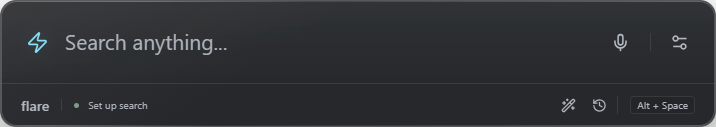

# Flare

A keyboard and voice command center for Windows. Find things, transform files, and keep control of every change.

**0.1 preview.** Local-first. No account, hosted database, or mandatory AI provider. Initial target: Windows 11 x64.



## Run

Use the locally generated installer, or extract the entire ZIP and run `Flare Portable.cmd`. Portable data stays in `FlareData` beside the app. Running `Flare.exe` directly uses per-user storage unless passed `--portable`.

Builds are unsigned and may trigger SmartScreen. No release is published automatically. Restore cleanup files before removing application data.

From source, install Node.js 24 or later on Windows:

```powershell
npm ci
npm run assets
npm run build
npm start
```

Use `npm run desktop:dev` for live UI development. `npm run dev` is a browser preview without native file access/search/voice.

## Use

- Tap `Alt+Space` to open; hold for 1 second for English voice. Silence-stop is the default; push-to-talk is available.
- Search apps, files, folders, bookmarks, Windows settings, or calculations. Arrows/Enter navigate; `Ctrl+Space` previews; Escape immediately hides Flare from any panel and cancels microphone/AI input, not ongoing file operations.
- Choose folders or connected drives in Settings before file indexing. Hidden/system files, reparse points, cloud-only files, credentials, and common caches are excluded.
- File tools provide image/PDF conversion, image compression, organization, and older-file review. Selected-file previews, durable history, and Undo protect changes. Balanced trust may skip the extra conversion-output review, never move/cleanup approval.
- Clipboard history starts off. Opt-in retains at most 50 text items for up to 7 days, with clear/disable controls and supported sensitive-content markers.
- Liquid-glass edges, pointer reflections, and elastic controls work in light/dark modes. Turn glass off in Settings; reduced-motion preferences are respected.

Examples: `open YouTube`, `volume max`, `brightness 50 percent`, `12 * (3 + 4)`, `find photos from June 2025`, `photos 2025-06-12`, `search drives D and E for invoice`.

## Intelligence

Connect Gemini, OpenAI, Anthropic, or local Ollama in Settings. API keys use Windows-backed Electron safeStorage and are never returned to the UI. Online interpretation shares command text, not indexed document contents. File tools still use locally selected files/folders.

When no local result matches, enabled Intelligence offers **Ask AI**. Answers are plain text; AI cannot see your indexed files or invent file changes. Checking a connection only validates model discovery, not generation quota or availability. A generation error links back to Intelligence so you can choose another text model. Flare never automatically retries billable requests.

ChatGPT/Claude/Gemini consumer subscriptions are not assumed to include API credits. Voice recognition can use Windows only, Windows with online fallback, or online transcription directly. Online modes are separately opt-in and send recorded audio to the selected OpenAI/Gemini provider. Speech models are independent of the Intelligence model, including Gemini 3.5 Transcribe and GPT-4o Transcribe/Mini. Local English recognition uses Windows speech; an English speech pack is required. Transcripts are reviewed before use. API availability and charges depend on the provider account.

Ollama setup links to the official installer, detects models, and offers an explicitly approved compact-model download with progress/cancel. Nothing is downloaded automatically.

## Scope

See [capabilities](docs/capabilities.md), [architecture](docs/architecture.md), and [verification](docs/verification.md).

This is an initial working build, not a finished autonomous assistant. No OCR, arbitrary shell execution, AI permanent deletion, universal conversion, or external-monitor DDC brightness. Large indexes, unusual documents, live speech, and provider/model compatibility need further validation.

Recovery does not expire automatically. Undo skips later edits and occupied original locations, and cannot recover missing backups. Removing the data folder can destroy recovery availability.

## Development

```powershell
npm test
npm run test:desktop
npm run test:bugs
npm run format:check
npm run package
```

Packaging creates an NSIS installer and ZIP under `release/`. Initial dependency/packaging downloads need internet. Desktop tests use isolated data and generated private fixtures, not your personal files. Close Flare before testing to release its global shortcut.

Private plans/prompts/references/evidence stay in ignored `Files/private/`. Generated dependencies and builds are ignored too. Do not force-add private material.

## License

Flare source: [MIT](LICENSE). Dependencies and models have separate terms; see [third-party notices](THIRD_PARTY_NOTICES.md) before redistribution.
